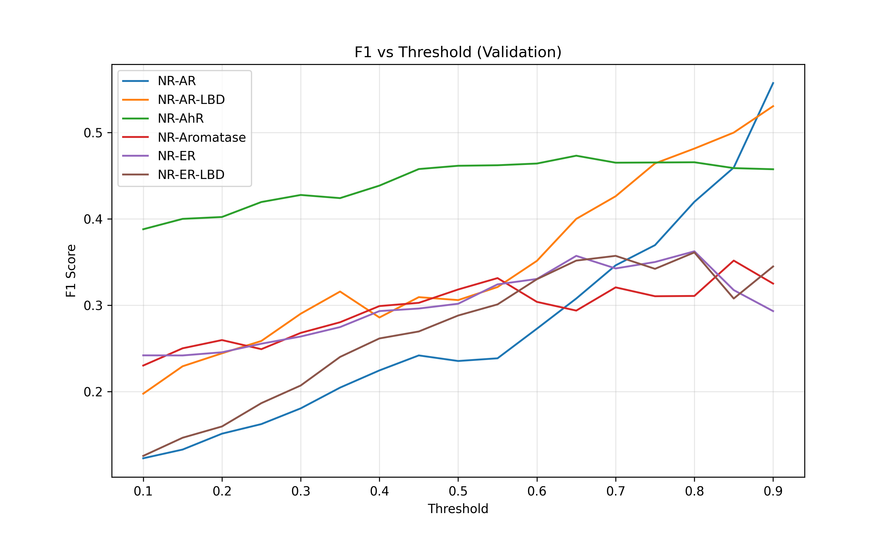

# 🧪 Tox21 Project – Final Evaluation Report
*Generated: 2026-02-13 17:12*
## 1. Model Performance Comparison
| Model           | Type           |   Macro PR-AUC |   Macro ROC-AUC |   Micro PR-AUC |   Micro ROC-AUC |
|:----------------|:---------------|---------------:|----------------:|---------------:|----------------:|
| XGBoost (ECFP4) | Baseline       |       0.350766 |        0.705791 |       0.355705 |        0.761469 |
| Descriptor MLP  | Neural Network |       0.326953 |        0.743381 |       0.322739 |        0.783176 |
**🏆 Best model:** XGBoost (ECFP4) (Macro PR-AUC = 0.3508)
## 2. Calibration
| Model | Brier Score |
|-------|-------------|
| XGBoost | 0.1025 |
| MLP | 0.1464 |
| GCN | 0.1538 |
| GAT | 0.1597 |
## 3. Optimal Thresholds (Validation F1)
| Task | Optimal Threshold | F1 |
|------|------------------|-----|
| NR-AR | 0.90 | 0.557 |
| NR-AR-LBD | 0.90 | 0.531 |
| NR-AhR | 0.65 | 0.473 |
| NR-Aromatase | 0.85 | 0.352 |
| NR-ER | 0.80 | 0.362 |
| NR-ER-LBD | 0.80 | 0.361 |
| NR-PPAR-gamma | 0.30 | 0.242 |
| SR-ARE | 0.70 | 0.565 |
| SR-ATAD5 | 0.90 | 0.276 |
| SR-HSE | 0.70 | 0.404 |

## 4. Big Data Integration
- **Spark MLlib LogisticRegression PR-AUC:** {'NR-AR': 0.9733476619838736, 'NR-AR-LBD': 0.9898117890501611, 'NR-AhR': 0.9792892077873021}
- **Featurization:** Used Spark UDF (distributed)
## 5. Conclusion & Limitations

- **Strengths:** Multiple models (XGBoost, MLP, GCN, GAT) with thorough hyperparameter tuning; calibration analysis; interpretability (SHAP, gradients); FastAPI deployment.
- **Limitations:** No data augmentation; ensemble not yet implemented; Big Data demonstration is minimal but shows distributed featurization.
- **Future work:** Add ensemble, test on larger dataset with full Spark cluster.
