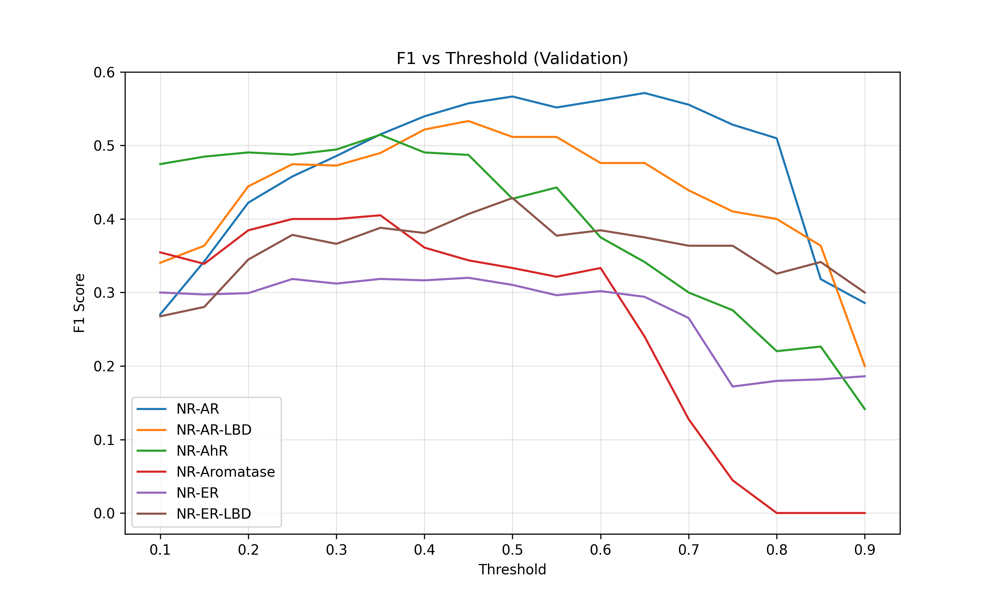

# 🧪 Tox21 Project – Final Evaluation Report
*Generated: 2026-02-13 09:25*
## 1. Model Performance Comparison
| Model               | Type           |   Macro PR-AUC |   Macro ROC-AUC |   Micro PR-AUC |   Micro ROC-AUC |
|:--------------------|:---------------|---------------:|----------------:|---------------:|----------------:|
| XGBoost (ECFP4)     | Baseline       |       0.350766 |        0.705791 |       0.355705 |        0.761469 |
| Descriptor MLP      | Neural Network |       0.356454 |        0.757583 |       0.382276 |        0.791607 |
| GNN (GNN_GAT_TUNED) | GNN            |       0.261084 |        0.72186  |       0.273597 |        0.76965  |
**🏆 Best model:** Descriptor MLP (Macro PR-AUC = 0.3565)
## 2. Calibration
| Model | Brier Score |
|-------|-------------|
| XGBoost | 0.1025 |
| MLP | 0.0734 |
| GCN | N/A |
| GAT | N/A |
## 3. Optimal Thresholds (Validation F1)
| Task | Optimal Threshold | F1 |
|------|------------------|-----|
| NR-AR | 0.65 | 0.571 |
| NR-AR-LBD | 0.45 | 0.533 |
| NR-AhR | 0.35 | 0.515 |
| NR-Aromatase | 0.35 | 0.405 |
| NR-ER | 0.45 | 0.320 |
| NR-ER-LBD | 0.50 | 0.429 |
| NR-PPAR-gamma | 0.20 | 0.222 |
| SR-ARE | 0.20 | 0.558 |
| SR-ATAD5 | 0.30 | 0.281 |
| SR-HSE | 0.10 | 0.370 |

## 4. Big Data Integration
- **Spark MLlib LogisticRegression PR-AUC:** {'NR-AR': 0.9733476619838736, 'NR-AR-LBD': 0.9898117890501611, 'NR-AhR': 0.9792892077873021}
- **Featurization:** Used Spark UDF (distributed)
## 5. Conclusion & Limitations

- **Strengths:** Multiple models (XGBoost, MLP, GCN, GAT) with thorough hyperparameter tuning; calibration analysis; interpretability (SHAP, gradients); FastAPI deployment.
- **Limitations:** No data augmentation; ensemble not yet implemented; Big Data demonstration is minimal but shows distributed featurization.
- **Future work:** Add ensemble, test on larger dataset with full Spark cluster.
